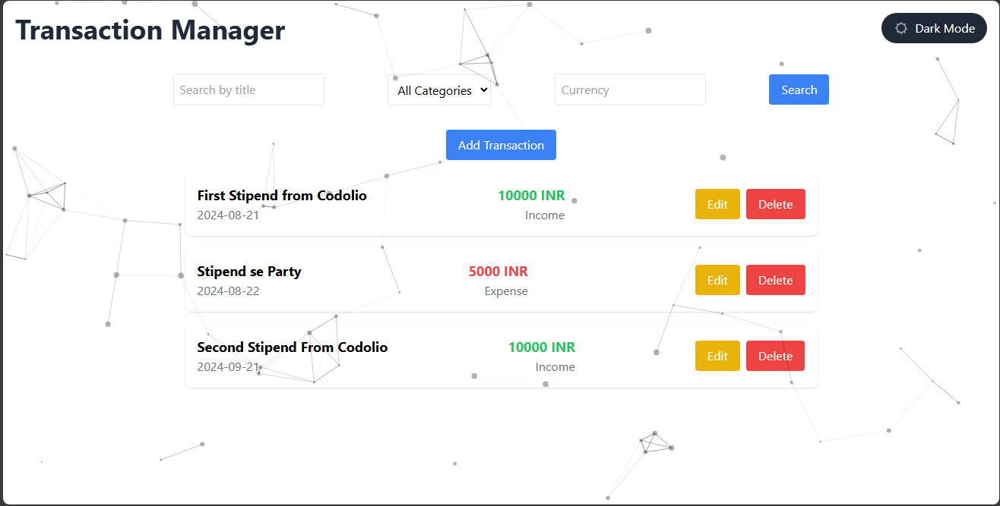
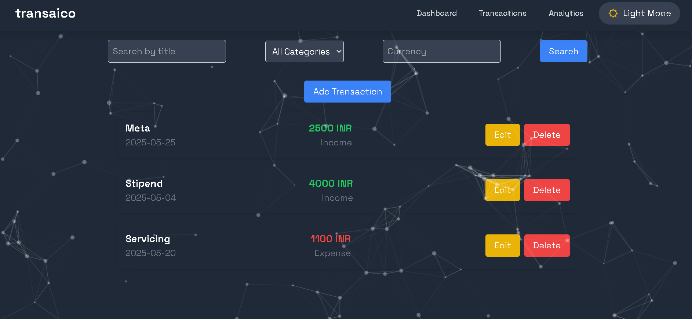

# Transaction Manager

## Overview

Transaction Manager is a web application designed to help users manage and track their financial transactions efficiently. It provides features to add, edit, filter, and list transactions with a user-friendly interface. The application is responsive, ensuring optimal usability across various devices and screen sizes.




## Features

- **Add Transactions:** Add new transactions with detailed information.
- **Edit Transactions:** Modify existing transactions.
- **Search Transactions:** Filter transactions based on criteria such as title, category, and amount type.
- **Responsive Design:** The application is optimized for desktops, tablets, and mobile devices.
- **User-Friendly Interface:** Clean and intuitive design for a seamless user experience.

## Tech Stack

- **Frontend:**

- **React:** A JavaScript library for building user interfaces. It allows for the creation of reusable UI components and manages the state of the application efficiently.
- **TypeScript:** A statically typed superset of JavaScript that provides type checking and better tooling. It helps in catching errors early during development.
- **Tailwind CSS:** A utility-first CSS framework that provides low-level utility classes to build custom designs without leaving the HTML. It enables rapid UI development and ensures consistency across the application.

## Installation

### Prerequisites

Before you begin, ensure you have the following installed:

- Node.js (>= 14.x)
- npm (>= 6.x)

### Steps

1. **Clone the Repository:**
```sh
https://github.com/DeepRahangdale/Transaction-Manager.git
cd transaction-manager
```
2.Install Dependencies:
   ```sh
  npm install
   ```
3.Start the Development Server:
```sh
npm start
```

## Usage
- ** Add Transaction: Click the "Add Transaction" button and fill out the form.
- ** Edit Transaction: Click the "Edit" button next to a transaction to modify its details.
- ** Search Transactions: Use the Search to narrow down the list of transactions based on your criteria.

## Contributing

We welcome contributions! To contribute to this project, follow these steps:
1. Star the repository.
2. Fork the repository. (Click the Fork button in the top right of this page, click your Profile Image)
3. Clone the forked repository to your local machine.

```markdown
https://github.com/DeepRahangdale/Transaction-Manager.git
```

4. Change the present working directory.

```markdown
cd transaction-manager
```

5. Make a new branch

```markdown
git checkout -b feature-name
```

6.Install the dependencies for the Project.

```markdown
npm install
```

7. Make your changes and commit them.

```markdown
git commit -am 'Add new feature'
```

8.Push your changes to your fork.

```markdown
git push origin feature-name
```

9. Submit a pull request detailing your changes.

Please ensure your code follows the project's coding standards and includes appropriate documentation.

## Contact
If you have any questions or feedback, feel free to reach out:
Email: deeprahangdale2003@gmail.com


Feel free to customize the details such as the GitHub repository URL, email, and other contact information to match your project's specifics.
