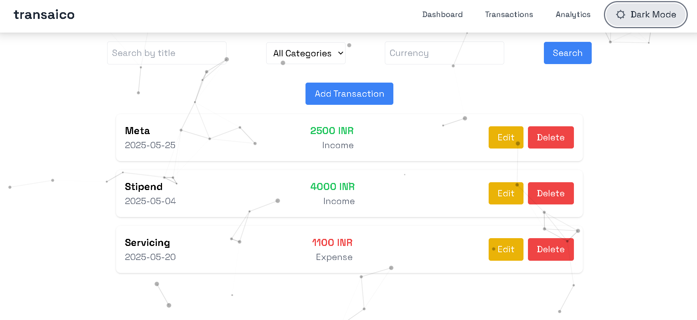

# Transaico – Smart Transaction Manager

## 🚀 Overview

**Transaico** is a modern web application designed to help users track and manage financial transactions with ease. It features a clean, responsive UI that works seamlessly across desktops, tablets, and mobile devices.

  


---

## ✨ Features

- ✅ Add, Edit, and Delete transactions  
- 🔍 Real-time search and filters (by title, category, or amount type)  
- 🎨 Dark & Light Mode Support  
- 📱 Responsive across devices  
- 🧠 Intuitive and minimal UI/UX  

---

## 🛠️ Tech Stack

### Frontend
- **React.js** – Component-based UI  
- **TypeScript** – Safer JavaScript with types  
- **Tailwind CSS** – Utility-first, fast styling  

---

## ⚙️ Installation

### Prerequisites
- [Node.js](https://nodejs.org/) (v14 or higher)  
- npm (v6 or higher)  

### Steps

```bash
# Clone the repository
git clone https://github.com/onurags/transaico.git
cd transaico

# Install dependencies
npm install

# Start the development server
npm start 
